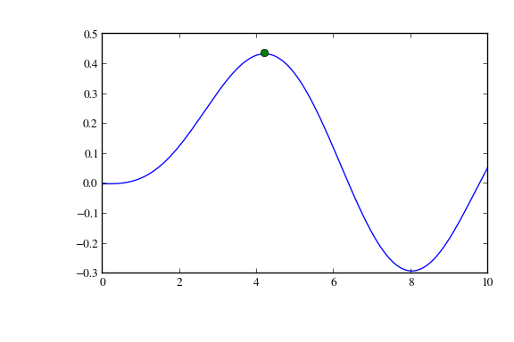

===============
Getting Started
===============

This page is intended to help the beginner get a handle on SciPy and be
productive with it as fast as possible.

What are NumPy, SciPy, matplotlib, ...?
---------------------------------------

SciPy and friends can be used for a variety of tasks:

* *NumPy*'s array type augments the Python language with an efficient data
  structure useful for numerical work, e.g., manipulating matrices.  *NumPy*
  also provides basic numerical routines, such as tools for finding
  eigenvectors.

* *SciPy* contains additional routines needed in scientific work: for example,
  routines for computing integrals numerically, solving differential equations,
  optimization, and sparse matrices.

* The matplotlib_ module produces high quality plots. With it you can turn your
  data or your models into figures for presentations or articles. No need to do
  the numerical work in one program, save the data, and plot it with another
  program.

* Using IPython_ makes interactive work easy. Data processing, exploration of
  numerical models, trying out operations on-the-fly allows to go quickly from
  an idea to a result. See the `IPython site <http://ipython.org/>`__ for many
  examples.

* There is a sizeable collection of both generic and
  application-specific numerical and scientific code, written using
  Python, NumPy and SciPy. Don't reinvent the wheel, there may already
  be a pre-made solution for your problem. See
  :doc:`topical-software` for a partial list.

* As Python is a popular general-purpose programming language, it has
  many advanced modules for building for example interactive
  applications (see e.g. wxPython_ and Traits_) or web sites (see
  e.g. Django_). Using SciPy with these is a quick way to build a
  fully-fledged scientific application.

How to work with SciPy 
---------------------- 
Python is a programming language, and there are several ways to
approach it. There is no single program that you can start and that
gives an integrated user experience.  Instead, there are several
possible ways to work with Python.

The most common is to use the advanced interactive Python shell
IPython_ to enter commands and run scripts. Scripts can be written
with any text editor, for instance Emacs_, Vim_ or even Notepad.  Some
of the packages such as *Python(x,y)* mentioned in :doc:`install` also
offer an integrated scientific development environment.

Neither SciPy nor NumPy provide plotting functions. There are several
plotting packages available for Python, the most commonly used one being
matplotlib_.

Learning to work with SciPy
---------------------------

To learn more about the Python language, the `official Python tutorial`_ is
an excellent way to become familiar with the Python syntax and objects.

One way of getting a handle on the scientific computation tools in Python
is to take a look at the following online resources:

- `Python Scientific Lecture Notes <http://www.scipy-lectures.org/index.html>`_

- `NumPy User Guide <http://docs.scipy.org/doc/numpy-dev/user/>`_ 

- `SciPy Tutorial <http://docs.scipy.org/doc/scipy/reference/tutorial/index.html>`_ 
  contains examples for each submodule in the SciPy library

- `Matplotlib beginner's guide <http://matplotlib.org/users/beginner.html>`__

- `Pandas tutorials <http://pandas.pydata.org/pandas-docs/stable/tutorials.html>`__

- `Sympy tutorial <http://docs.sympy.org/latest/tutorial/>`__

In addition, a number of books have been written on numerical
computation in Python, see for example a
`Google search on books related to SciPy <http://www.google.com/search?q=scipy+scientific+python&tbm=bks>`__.

An example session
##################

To give a simple example of typical interactive use, we find and plot
the maximum of a Bessel function. If you have worked with numerical
computation environments before, what follows looks very familiar.

This assumes you have installed the SciPy stack, for example following
the instructions in :doc:`install`.  

.. sourcecode:: ipython

   $ ipython --pylab

   Python 2.7.4 (default, Apr 19 2013, 18:28:01) 
   Type "copyright", "credits" or "license" for more information.

   IPython 0.13.2 -- An enhanced Interactive Python.
   ?         -> Introduction and overview of IPython's features.
   %quickref -> Quick reference.
   help      -> Python's own help system.
   object?   -> Details about 'object', use 'object??' for extra details.

   Welcome to pylab, a matplotlib-based Python environment [backend: Agg].
   For more information, type 'help(pylab)'.

   In [1]: from scipy import special, optimize

   In [2]: f = lambda x: -special.jv(3, x)

   In [3]: sol = optimize.minimize(f, 1.0)

   In [4]: x = linspace(0, 10, 5000)

   In [5]: x
   Out[5]: 
   array([  0.00000000e+00,   2.00040008e-03,   4.00080016e-03, ...,
            9.99599920e+00,   9.99799960e+00,   1.00000000e+01])

   In [6]: plot(x, special.jv(3, x), '-', sol.x, -sol.fun, 'o')

   In [7]: savefig('plot.png', dpi=96)

An example script
#################

The above example session can be written as a non-interactive script
as follows. Here, we don't give the simplest example possible, but
follow what is considered good practice on command-line scripts.

Contents of a file ``example.py``:

.. literalinclude:: getting-started-example.py
   :language: python

.. _Traits: http://code.enthought.com/projects/traits/
.. _wxPython: http://www.wxpython.org/
.. _IPython: http://ipython.org/
.. _matplotlib: http://matplotlib.org/
.. _Emacs: http://www.gnu.org/software/emacs/
.. _Vim: http://www.vim.org/
.. _official Python tutorial: http://docs.python.org/tutorial/
.. _Django: https://www.djangoproject.com/
